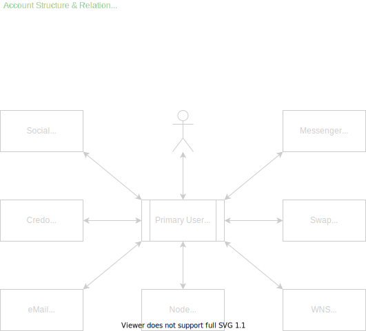

# Global Wealth &amp; Freedom Decentralized Social Platform

|                                                                                                                                                      |                                                                                                                                                                                       |
| :--------------------------------------------------------------------------------------------------------------------------------------------------: | ------------------------------------------------------------------------------------------------------------------------------------------------------------------------------------: |
|  |                                                              <h1>Global Wealth &amp; Freedom</h2><h3>Your Social Platform, Your Way! We are the unified social platform for all!</h3> |
|  | <h5>MySocial: https://gwf.io</h5><h5>MediaJunky: https://media-junky.com</h5><h5>MyMail: https://webmail.gwf.io</h5><h5>MyChat: https://chat.gwf.io</h5><h5>MyDEX: https://swap.gwf.io</h5> |
| Social Links | [Discord](https://discord.gg/Tn87FSP3) - [LinkedIN](https://www.linkedin.com/showcase/gwf-platform) - [Twitter](https://twitter.com/GWFPlatform) - [Telegram](https://t.me/GWFPlatform) - [GWF Social](https://social.gwf.io/gwfplatform) |


## Notice

> PLEASE READ THIS WHITEPAPER IN ITS ENTIRETY AND ONLY AFTER THOROUGH RESEARCH ON YOUR PART, IF YOU DECIDE YOU WOULD LIKE TO INVEST AND SUPPORT THIS PROJECT, PLEASE STAY WITHIN YOUR MEANS.

This project is has been created and will be developed by Nlaak Studios, LLC a Texas-based S-Corp. Currently, the online sites are traditional sites with licensed code and so are private repositories. However, the project, when finished will be 100% decentralized and governed by the community.

With the migration of the current traditional centralized sites to off-shore dedicated servers that are secure and provide favourable data security laws complete, we have only left GWF.IO (Social) and Media-Junky.com (Video Sharing) online at this time. The others will be available again when we release the new Decentralized Platform, including the complete re-write of GWF Social and Media Junky.

Once the Core Development team is in place we will get the Official Whitepaper and Road map released.

## About Us

### Tagline

Your Social Platform, Your Way! We are the unified decentralized social platform for all!

### Mission

To provide a secure social media platform able to serve any content distributor while ensuring Privacy, user control.

### Vision

To build a system of social networking that gives users Privacy, Security, and Freedom on their legal content distribution.

### Summary

GWF is a unified decentralized social media platform that allows you to be responsible for your content.
Global wealth and Freedom platform allow for all types of content Social Networking, Video Sharing, and Instant Messaging with Audio & Video calls, Micro-Blogging, Blogging, DEX, and much more.

GWF is a no censoring, no tracking, and no ads platform where you have complete control of your online presence, content, security, and Privacy.
You will love the GWF platform as it doesn't use cookies – otherwise known as trackers- to generate revenue; hence you can be confident that we do not sell your content to advertisers. The platform also allows for ultimate freedom of expression as there is no censoring, thus enabling you to take control and push your content. 

We believe users can think for themselves and hence be able to decide what they want to consume. Therefore, the ultimate goal is not for us to "Define" the platform - but rather to listen to our user's feedback and suggestions and build the social platform for the future.
With GWF, you can say goodbye to big tech with all their tracking, ads, and censoring and say Hello to your personalized social network where you have full control of your online presence, content, security, and Privacy.

However, this system is not intended for "Drug Lords," "Arms Dealers," and "Developers of Mass Destruction." It's intended to protect the rights and privacy of law-abiding everyday end users. We must also still abide by the "Know Your Customer" (KYC) and "Anti Money Laundering" (AML) laws as set forth and must be honoured in most countries on the planet.

Best of all ... It's all one a single App and uniform across all platforms. Leave off on your desktop and pick up on the go with your mobile. It's all seamless.

### Core Values

#### Privacy

Keep your content within the locus of your control. With our no ads policy, your data is not sold to advertisers as an income generation scheme. We will strive to implement every feature known to protect the identity of the users of this token. Strong encryption. No one should be aware that you are using this system unless you somehow make them aware of it.

#### Security

As with Privacy, we will strive to implement the most robust security features, but with emphasis on not hindering the end, users' use of the system. There will be many layers of security that you can turn on or off when desired.

#### Performance

With the Front-end primary app created with Flutter, it allows for a single code base for developers (Web, iOS, Android, Windows, Mac, and Linux) and a standardized and easy-to-use interface for the users.

#### Versatility

As long as your content remains to be legal, we don't practice censorship. It is our firm belief that anyone who uses our platform is able to choose for themselves what they want to consume.

#### Sustainability

We are using the absolute latest in technology to create the only 100% decentralized & Self-Sustaining Social Platform for the future.


***



## Protocols

|                                                                               Logo                                                                                | Function  | Alts/Example | Description |
| :---------------------------------------------------------------------------------------------------------------------------------------------------------------: | :-------- | :---------- | ----------: |
|  | Social    | Facebook    | Facebook like Social Media using a dedicated side-chain and InterPlanetary File System (IPFS) providing full privacy, security and zero censoring. Implements an account notoriety system |
|    | MyTube    | YouTube     | Youtube like Video Sharing & Streaming service using a dedicated side-chain and InterPlanetary File System (IPFS) Like Social, provides full privacy, security and zero censoring and also implements an account notoriety system |
|    | Credo     | Twitter     | Twitter like MicroBlogger with some added features and minor tweaks. Uses a dedicated side-chain and InterPlanetary File System (IPFS) Like Social, provides full privacy, security and zero censoring and also implements an account notoriety system |
|      | eMail     | GMail       | GMail like Email service using a dedicated side-chain and InterPlanetary File System (IPFS). This does not use traditional POP or IMAP protocols but instead is a new IMAP-Like decentralized solution that will have built-in SPAM control and penalties. Like Social, provides full privacy, security and zero censoring. |
|      | Messenger | Multiple    | Instant Messenger service including Full Encryption, Regions, Rooms, Screen sharing, VOIP, Video Calling all using a dedicated side-chain and InterPlanetary File System (IPFS). Like Social, provides full privacy, security and zero censoring. |
|      | Node Dashboard | N/A    | Your Node Dashboard & Control Panel. Everyone has at the very least a minimal "Micro-Node" that performs consensus. You have the option of choosing how much of your hardware (CPU, HDD and Bandwidth) you wish to allot to the Node and generate revenue. |
|      | Wallet | N/A    | Stores the public and/or private keys for your primary account and all side-chain account transactions. Also used for digitally signing information. |
|      | Wallet Name Service | N/A    | Never remember your cryptic wallet addresses again! The Wallet Name Service works much like a traditional Domain Service including standard Top Level Domains (TLDs) via a dedicated side-chain and InterPlanetary File System (IPFS). |
|      | Swap (DEX) | Sushi, uniswap, 1inch | Your personally tailored Decentralized Exchange using a dedicated side-chain and InterPlanetary File System (IPFS). Allows you to quickly and easily "Swap" between supported tokens and provides One-Click Cross chain transfers to/from USDC and USDT. Full De-Fi, Staking, Liquidity Pools plus several new features building upon prior "Swap Platforms" such as Sushi, uniswap, 1inch |

***

## Team

### Senior Management

#### Chief Executive Officer (CEO) & Founder

> Andrew Donelson
> [LinkedIN](https://www.linkedin.com/in/andrew-donelson/) - [Twitter](https://twitter.com/AndrewDonelson) - [Telegram](https://t.me/GWFPlatform) - [GWF Social](https://gwf.io/AndrewDonelson)

#### Chief Financial Officer (CFO)

> Carolyn Donelson - [LinkedIN](https://www.linkedin.com/in/carolyn-donelson-0b939a97/) - [GWF Social](https://gwf.io/CQ925)


#### Lead Senior Software Engineer

> Rangaballava Swain
> [LinkedIN](https://www.linkedin.com/in/rangaballava-swain-53592437/) - [GWF Social](https://gwf.io/)

##### Lead Senior Development & Operations 
> Radu Stanca
> [GWF Social](https://gwf.io/https://social.gwf.io/rstanca)

### Developers

All developers will receive ‘bounties’, which are payments in the form of GWF tokens, in exchange for joining the project. See the **Planned Token Allocation** table below. If you are interested and end up being selected as a Core Developer - please do not quit your day job just yet as we will not have developer funds until the base token contract(s) are finalized and deployed and the **Crowdsale** (see below) has completed. This can only be done once the Core Team is in place. 

#### Core Team

All Core Team members will be Co-Founders of the project as well as a Vice President of Engineering in their particular role. For example, if You are selected to lead the Blockchain development your title with the Project will be VP Engineering in Blockchain Technology. We will start actively looking for Core Developers beginning July 1st, 2021. All VP Engineering professionals will report directly to the CEO and manage their teams.

##### VP Engineering in Project Management 

> You must be a Master of Github. We will be using that for everything - You will not find JIRA or Confluence anywhere. You will directly with all VP's and the CEO.

> This role is not yet filled.

##### VP Engineering in Blockchain Technology

> Must be expert in languages Go & Web3. Must have extensive experience with Ethereum blockchain and Matic/Polygon. Rust and Solidity & Smart Contracts is optional but would help the team overall. You will hire and lead a team consisting of One Senior Blockchain developer and two Junior Blockchain developers.

> This role is not yet filled.

##### VP Engineering in Smart Contracts Technology

> Must be expert in languages Solidity & Web3. Must have extensive experience with all forms of Smart Contacts and common libraries used. You will hire and lead a team consisting of One Senior Smart Contract developer and one Junior Smart Contract developer.

> This role is not yet filled.

##### VP Engineering in UIX Technology

> Must be expert with Flutter including the languages of Dart, Javascript & Web3. The primary App will support the latest Flutter version and will support Web, iOS, Android, Windows, Mac and Linux platforms. You will hire and lead a team consisting of Two Senior Flutter developers and Two Junior Flutter developers.

> This role is not yet filled.

##### VP Digital Community Services

> Overall responsibility is to drive growth and strategic renewal by building a community around the project using Social Media thus creating new value through the smart use of digital tools, platforms, technologies, services, and processes.

> This role is not yet filled.

##### VP Marketing

> Will be responsible for overseeing a company’s overall advertising and sales strategy. Duties include developing the structure of the business’s and projects marketing department, creating and/or approving marketing campaign ideas and coordinating marketing efforts with the company’s financial and branding goals.

> This role is not yet filled.

## BLOCKCHAIN SOCIAL MEDIA PLATFORM

Decentralized social networks will become widespread in the aftermath of the Facebook and Twitter censorship issues as well as the Facebook, Cambridge Analytica scandal.

And then there's the fact that people just want their privacy and they don't want to be tracked and have their information sold for ad targeting.


### com.nlaak.gwf.blockchain

Global Wealth &amp; Freedom Blockchain is built with Ethereum Technology (go-ethereum) which provides the core components and tools to join the new, borderless economy and society.
It will be a fully sovereign Ethereum-compatible blockchain network. Our network is fully in charge of our own security, i.e. have our own pool of validators. Our Stand-alone chain offers the highest level of independence and flexibility.

#### Account Breakdown & Summary

As stated on our [project page](https://landing.gwf.io) our `Core Values` are

- Privacy: Simple control over whom sees what
- Security: You own your keys, therefore your content
- Versatility: Protocols allow infinite expansion
- Performance: Lighting fast blockchain (6 sec)
- Sustainability: Official Validators instead of Miners (energy/cost savings). All content stored on IPFS and backed up to Filecoin

The best way to see how we go about doing this is to take a look and an example master account file.

### Current Configurable properties

These are provided by the `User` object

- Username -> Your unique username (Required)
- avatar -> the CID of your avatar on GWFStorage
- Status -> your current status (online, away, dnd, etc)
- Name -> your real name
- Email -> your email address
- Mobile -> your mobile phone number
- Gender -> [M]ale, [F]emale, [O]ther, [U]ndefined (Default)
- Country -> your country code ie. [US]
- Bio -> short text, anything you desire
- FollowingCount -> Number of accounts your following (in progress)
- FollowAccounts -> The list of accounts you are following (in progress)
- FollowerCount -> Number of accounts your following you (in progress)
- FollowerAccounts -> The list of accounts that are following you (in progress)

Please note that everything defaults to `Private`. You must add accounts to the groups and choose which properties to make visible for each group. You can see an example of this in the Account JSON above.

##### Allowed Devices

Just like many other apps you can save and allow access to only certain devices. These are provided (if any) in the `Account.Devices` property.

##### Preferences

TODO

##### Following

TODO

##### Followers

TODO

##### Share Groups

GWF Smartchain uses what we call `share groups` to give the user simple and total control over
<u>who can view what content</u>. At this time we just have these basic properties available

###### Available Share Groups

- 0 Private         (DEFAULT) only owner has full access
- 1 Family          Accounts in this group can view allowed content
- 2 Friends         Accounts in this group can view allowed content
- 3 Coworkers       Accounts in this group can view allowed content
- 4 Followers       Accounts in this group can view allowed content
- 5 Denied          Accounts in this group cannot view any content
- 6 Public          Anyone can view allowed content

All of this happens on-chain. All encryption and decryption happen on-chain storing/retrieving content. So everything
stored on GWFStorage (IPFS/Filecoin) is 100% secured for each individual user

In the app, you will be able to very easily configure your share groups. There are two (2) steps that must be done.

- First, configure each shared groups properties. These are Checkboxes for all properties which are `unchecked` by default. `Check` the properties you want <u>this</u> group to view.
- Second, add users to each `share group`. Under each group, you can add a user via

  1. Magic URL Link via Mobile Text Message (Enter Phone #)
  2. Magic URL Link via Email (Enter Email)
  3. Scan QR Code
  4. Enter User Account Address Manually

Let's say you have a coworker who becomes a good friend. You simply move their account address from the `Coworker` group to the `Friends` group. There is also a `Denied` group where you can place any accounts that you do not wish to have access to any of your content.

###### Why go through so much trouble?

We believe that the user owns their content and should have any amount of privacy that they desire. We also extend this
to cryptocurrencies on our DEX. No one should know what you are buying, selling or holding in your wallet. Your Defi wallet is a separate account only visible to you. You cannot expose it to your `Share Groups`. We do not believe that governments should have permission to monitor and tax you at this point. When you move your crypto to a government fiat currency, then the laws and taxes applicable to the fiat should be applied.

So, the answer to the question is simple. If `WE` as an entity providing you with service cannot decrypt and see the content - then a <u>supena is worthless</u>.

##### Protocols

Protocols allow us to determine what app handler should process the data once it is decrypted on your device. For example, if someone you are following posted a tweet on `Credo` (our version of Twitter) that is where it would be sent within the app. On the other hand, if you have a notification of say a new blog post then it would be sent to that handler.

This allows us to infinitely add content to the app over time by using the same underlying processes.

#### Example Account JSON

Below you will find an example master file for a user account. This file is saved on GWF Storage encrypted with your key so that only you can access the contents.<br />
<u>No other access is possible unless you share your account address and pass phrase</u>.

> ^^^ <b>DO NOT EVER, EVER DO THAT</b> ^^^

This file is only updated when

- You post content
- Update Shared Groups
- Update your User Information

When you start the app, this is the first thing to be retrieved, decrypted on your device and then populated in your UI.

```json
{
    "Responsetype": {
        "Message": "Success",
        "Code":    200,
        "Version": "v1.2.3"
    },
    "User": {
        "ID": "0x0",
        "Wallet":"0xYOURPRIVATEDEFIWALLET",
        "Username":"LGB2021",
        "avatar":"bafybeidd2gyhagleh47qeg77xqndy2qy3yzn4vkxmk775bg2t5lpuy7pcu",
        "Status": "Away",
        "Name": "Lesgo Brandon",
        "Email": "foo@bar.com",
        "Mobile": "555-123-4567",
        "bio":"Hello World! Here is some basic information about myself",
        "Verified": true,
        "RegisterDate": 1234567890,
        "PasswordDate": 1234567890
    },
    "Devices":{
        "0": {
            "DeviceName":"smartphone",
            "DeviceBrand":"Google",
            "DeviceModel":"Nexus 5",
            "DeviceID":"756h9634as8654d"
        },
        "1": {
            "DeviceName":"desktop",
            "DeviceBrand":"Microsoft",
            "DeviceModel":"Windows 10",
            "DeviceID":"6531ab31a37611e"
        }
    },
    "Preferences": {
        "ExamplePrefs":"For example only",
        "UnlockMode":"fingerprint",
        "UnlockSolution":"",
        "MuteNotifications":false,
        "AllowInLaws": false,
        "AlertMeForFamilyBirthdays": true,
        "AlertMeForFriendsBirthdays": true,
        "AlertMeForCoworkersBirthdays": false,
    },
    "Following":{
        "0":"0x03",
        "1":"0x02"
    },
    "Followers":{
        "0":"0x07",
        "1":"0x06",
        "2":"0x05",
        "3":"0x04"
    },
    "Sharegroups": {
        "1": {
            "ID": 1,
            "Name": "Family",
            "View": "username,avatar,bio,name,email,phone,status,followingCount,followAccounts,followerCount,followerAccounts",
            "Wallets": {
                "0":"0x01",
                "1":"0x07",
                "2":"0x0A",
            }
        },
        "2": {
            "ID": 2,
            "Name": "Friends",
            "View": "username,avatar,bio,name,email,phone,status,followingCount,followerCount",
            "Wallets": {
                "0":"0x03",
                "1":"0x02",
                "2":"0x0B",
                "3":"0x08",
                "4":"0x09",
            }
        },
        "3": {
            "ID": 3,
            "Name": "Coworkers",
            "View": "username,avatar,name,phone,followingCount,followerCount",
            "Wallets": {
                "0":"0x0C",
                "1":"0x0F",
                "2":"0x0H",
                "3":"0x0W",
                "4":"0x0Z",
            }
        },
        "4": {
            "ID": 4,
            "Name": "Followers",
            "View": "username,avatar,bio,followerCount,followerAccounts,status",
            "Wallets": {
                "0":"0x0C",
                "1":"0x0Z",
                "2":"0x0F",
                "3":"0x03",
                "4":"0x02",
                "5":"0x0B",
                "6":"0x0F",
                "7":"0x0H",
                "8":"0x01",
                "9":"0x07",
                "10":"0x0A",
                "11":"0x0W"
            }
        },
        "5": {
            "ID": 5,
            "Name": "Denied",
            "View": "",
            "Wallets": {
                "0":"0x0666",
                "1":"0x0IRS",
                "2":"0x0INLAWS"
            }
        },
        "6": {
            "ID": 6,
            "Name": "Public",
            "View": "username,avatar,followingCount,followerCount",
            "Wallets": {
                "0":"*"
            }
        }
    },
    "protocols":{
        "credo":{
            "posts":{
                "UNIX-TIMESTAMP":"0x5CID",
                "UNIX-TIMESTAMP":"0x4CID",
                "UNIX-TIMESTAMP":"0x3CID",
            },
            "likes":{
                "UNIX-TIMESTAMP":"0x6CID"
            },
            "dislikes":{
                "UNIX-TIMESTAMP":"0x8CID",
                "UNIX-TIMESTAMP":"0x7CID"
            }
        },
        "blog":{
            "UNIX-TIMESTAMP":"0x0CID",
            "UNIX-TIMESTAMP":"0x1CID",
        }
    }
}
```

## GWF Primary Token (ERC20)

This token is used for raising the Working Capital needed to complete the project and will represent the overall value of the Platform and its success. It is a standard ERC20 Finite (Limited Supply) token on the Ethereum Blockchain. You can find more details below.

Besides everything you can do with an Ethereum Token, you will also be able to SWAP for GWFU (GWF Utility Tokens) used by the platform and GWFS (GWF Stable Coin) directly the GWF DEX.

### Contract Details

- Token Type:         Fixed Supply ERC-20
- Token Name:         Global Wealth and Freedom
- Token Symbol:       GWF
- Decimals:           18
- Total Supply:       202445471 GWF
- Paying Account:     0x91DBde1652d54d83eE60576833b5A019b0980111
- Token Owner:        0x91DBde1652d54d83eE60576833b5A019b0980111

### Deployment

- Your transaction has been successfully submitted to Ethereum network
- GWF Token creation transaction hash is: 0x832c15b38df211c21976c159578de502d01fa98fe435ce6a38d461d65056d204
- GWF Token Smart Contract Address: 0xb19e5b2ec6e2b1d980939ad006dc6270fbacb322

### GWF-DEX Initial Liquidity

GWF Smartchain [Decentralized Exchange](https://dex.gwf.io)

In Progress...

- Starting Price:     0.0000408 GWF
- Liquidity Range:    0.00000204
- Min:                0.00003876 ETH per GWF
- Max:                0.00004284 ETH per GWF


### Planned Token Allocation
<p style="color:red">Disregard - Out of date. Will be updated</p>

All tokens (The Total Supply) are currently sitting in a wallet until the Core Team / Co-Founders are brought on board. At this time all the final details/values will be agreed upon. The table below is a design estimate and is not guaranteed. The Estimated Value in USD column below is based on $0.30 USD per Token. This is the average of the Crowdfunding Start and Ending prices and are subject to change.

All project (Management & Team) token allotments will be regulated by the smart contract allowing for the optional sale of up to 5% every 3 months (90 days) and will not carry over.

All remaining Project Development Funds (after Allotments) will be used to cover operations and expenses.


| Phase      |  Status  | Description                                                  | Pct / Total |   Num Tokens   |  Est. Value (USD)  |
| :--------- | :------: |:------------------------------------------------------------ | :---------: | :------------: | :----------------: |
| Alpha      |    -     | Project Development Fund Management (PDFM)                   |    20%      |  40,489,094    |     ~ $12.1M       |
| Alpha      |  Filled  | PDFM - Nlaak Studios CEO & GWF Founder                       |    0.075%   |   3,036,682    |     ~ $911K        |
| Alpha      |  Filled  | PDFM - Nlaak Studios CFO                                     |    0.05%    |   2,024,454    |     ~ $607K        |
| Alpha      |    -     | Project Development Fund Core Team (PDFT)                    |             |                |                    |
| Bravo      |  Filled  | PDFT - VP Engineering in Development & Operations Technology |    0.035%   |   1,417,118    |     ~ $425K        |
| Bravo      | Inactive | PDFT - VP Engineering in Blockchain Technology               |    0.035%   |   1,417,118    |     ~ $425K        |
| Bravo      | Inactive | PDFT - VP Engineering in Smart Contracts Technology          |    0.035%   |   1,417,118    |     ~ $425K        |
| Bravo      | Inactive | PDFT - VP Engineering in UIX Technology                      |    0.035%   |   1,417,118    |     ~ $425K        |
| Bravo      | Inactive | PDFT - VP Engineering in Project Management                  |    0.035%   |   1,417,118    |     ~ $425K        |
| Bravo      | Inactive | PDFT - VP Digital Community Services                         |    0.035%   |   1,417,118    |     ~ $425K        |
| Bravo      | Inactive | PDFT - VP Marketing                                          |    0.035%   |   1,417,118    |     ~ $425K        |
| Charlie    | Inactive | PDFT - Senior Blockchain Developer (2)                       |    0.025%   |   1,021,227    |     ~ $306K        |
| Charlie    | Inactive | PDFT - Junior Blockchain Developer (2)                       |    0.020%   |     809,781    |     ~ $243K        |
| Charlie    | Inactive | PDFT - Senior Smart Contract Developer (1)                   |    0.025%   |   1,021,227    |     ~ $306K        |
| Charlie    | Inactive | PDFT - Junior Smart Contract Developer (1)                   |    0.020%   |     809,781    |     ~ $243K        |
| Charlie    | Inactive | PDFT - Senior Flutter (UIX) Developer (2)                    |    0.025%   |   1,021,227    |     ~ $306K        |
| Charlie    | Inactive | PDFT - Junior Flutter (UIX) Developer (2)                    |    0.020%   |     809,781    |     ~ $243K        |


### Initial Community Marketing Campaign

<p style="color:red">Disregard - Out of date. Will be updated</p>

#### Proposed 

**Get $250 USD worth of GWF tokens for free simply by joining our new community. Only 5 million tokens are available for this campaign. Continue reading to claim.**

1. Make sure you have Metamask installed.
2. Register an account on GWF social (https://social.gwf.io)
3. Follow GWF Platform on [LinkedIN](https://www.linkedin.com/showcase/gwf-platform) and Share.
4. Follow GWF Platform on [Twitter](https://twitter.com/GWFPlatform) and Re-Tweet.
5. Join our Official Community [Discord](https://discord.gg/Tn87FSP3) server

Finally, Direct message user GWF-Founder (Discord UserID: 329799685982388224) on our official discord server with the following content

1. Your Metamask wallet address
2. Your GWF Social Username
3. Your LinkedIn and Twitter usernames
4. That's it. We will get to each in order to send GWF to your wallet until the well dries out!

### Building working Capital

We are looking for early investors to help with the many expenses of getting this project off the ground.

- Community Marketing Campaign Allotment is 2.5% Total Supply or 5,061,136 GWF tokens. Available until all tokens are issued.
- Pre Crowdsale Allotment is 20% of the Total Supply or 40,489,094 GWF tokens with a direct purchase price of $0.050 USD per GWF token. Only available until Crowdsale starts.

#### Crowdsale

<span style="color:red">Out of date. Will be updated</span>

| Start       | End         | Description                               | Price  | Pct / Total | Num Tokens  |  Est. Value (USD)  |
| :---------- |:----------- |:----------------------------------------- | :----: | :---------: | :---------: | :----------------: |
| 01 AUG 2021 | 31 AUG 2021 | Crowdfunding Stage One                    | $0.100 |    10%      | 20,244,547  |    ~ $2,024,454    |
| 01 SEP 2021 | 21 SEP 2021 | Crowdfunding Stage Two                    | $0.200 |    10%      | 20,244,547  |    ~ $4,048,909    |
| 22 SEP 2021 | 06 OCT 2021 | Crowdfunding Stage Three                  | $0.300 |    10%      | 20,244,547  |    ~ $6,073,364    |
| 07 OCT 2021 | 21 OCT 2021 | Crowdfunding Stage Four                   | $0.400 |    10%      | 20,244,547  |    ~ $8,097,818    |
| 22 OCT 2021 | 31 OCT 2021 | Crowdfunding Stage Final                  | $0.500 |    10%      | 20,244,547  |   ~ $10,122,273    |
|  Totals     |      -      | Mean Price, % Total Supply, Est Value     | $0.258 |    70%      | 141,711,829 |   ~ $32,391,272    | 

If the crowdfunding is successful and sells all tokens (72.50% of Total Supply), the remaining 30% will be locked into Liquidity.


## GWF Utility Token

Mintable supply of tokens used by all aspects of the GWF platform. More details will be added after Core Teams / Co-Founders are selected and the project moves forward.
